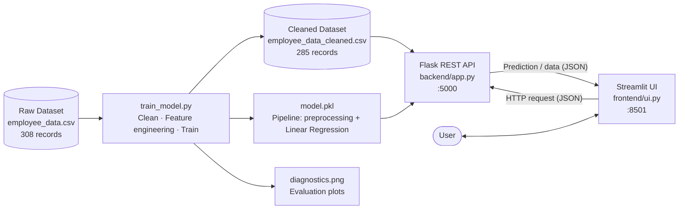

# 👩‍💼 Employee Salary Prediction

A full-stack machine learning web application that predicts employee salary based on age, performance rating, tenure, department, city, and remote-work status. Built as an internship project to demonstrate the complete flow from raw data to a working prediction UI.

- **Backend**: Flask REST API
- **Frontend**: Streamlit
- **ML Model**: Linear Regression (scikit-learn), wrapped in a preprocessing pipeline
- **Dataset**: `data/employee_data.csv` (raw, 308 records) → cleaned to `data/employee_data_cleaned.csv` (285 records) during training

---

## Key Features

- End-to-end data cleaning handled automatically by a single training script
- Single saved `Pipeline` (preprocessing + model), so predictions use exactly the same steps as training
- REST API with health check, prediction, dataset and model-info endpoints
- Interactive Streamlit UI with prediction, data exploration and model evaluation pages

---

## System Architecture

The diagram below shows how the data, model, backend and frontend connect to each other.



**Flow in short:** raw data is cleaned and used to train the model → the trained pipeline is saved as `model.pkl` → Flask loads it and exposes API endpoints → Streamlit calls those endpoints and shows the results to the user.

---

## About the Dataset

The raw dataset (`Employees_raw_Data_csv.csv`) is messy real-world-style data and needs cleaning before use:

| Column                | Notes |
|------------------------|-------|
| `emp_name`             | Employee name |
| `department`           | Engineering / HR / Marketing / Sales / Finance — inconsistent casing in raw data (e.g. `"SALES"`, `"Sales"`), some missing |
| `join_date`            | Used to engineer a `tenure_years` feature |
| `salary`                | **Target** — some rows missing |
| `age`                   | Some missing |
| `performance_rating`    | 1–5 scale, some missing |
| `city`                  | Pune / Delhi / Mumbai / Chennai / Bangalore |
| `remote_work`           | Yes/No — inconsistent casing (`"yes"`, `"NO"`, etc.), some missing |

`train_model.py` handles all of this automatically:
- Standardizes text casing in `department`, `city`, `remote_work`
- Drops rows with no `salary` (can't train/evaluate without the target)
- Drops duplicate employee records
- Converts `join_date` into a numeric `tenure_years` feature
- Imputes remaining missing values (median for numeric, most-frequent for categorical)
- One-hot encodes categorical columns

---

## Project Structure

```
employee_salary_project/
├── data/
│   ├── employee_data.csv           # Raw dataset (input)
│   └── employee_data_cleaned.csv   # Cleaned dataset (generated)
├── model/
│   ├── model.pkl                   # Trained pipeline: preprocessing + model (generated)
│   └── diagnostics.png             # Eval plots (generated)
├── backend/
│   └── app.py                      # Flask REST API
├── frontend/
│   └── ui.py                       # Streamlit UI
├── train_model.py                  # Model training script
├── requirements.txt
└── README.md
```

> **Note:** `model.pkl` now stores a single scikit-learn `Pipeline` that includes both preprocessing (imputing, scaling, one-hot encoding) and the regressor, so a separate `scaler.pkl` is no longer needed.

---

## Quickstart

### 1. Install dependencies
```bash
pip install -r requirements.txt
```

### 2. Add the dataset
Place `Employees_raw_Data_csv.csv` at `data/employee_data.csv`.

### 3. Train the model
```bash
python train_model.py
```
This cleans the data, trains the model, and saves `model/model.pkl`, `data/employee_data_cleaned.csv`, and `model/diagnostics.png`.

### 4. Start the Flask backend
```bash
python backend/app.py
```
API runs at **http://localhost:5000**

### 5. Launch the Streamlit frontend
*(open a second terminal)*
```bash
streamlit run frontend/ui.py
```
UI opens at **http://localhost:8501**

> **Tip:** Always start the Flask backend *before* the Streamlit frontend, since the UI fetches its data from the API.

---

## API Endpoints

| Method | Endpoint       | Description                          |
|--------|----------------|--------------------------------------|
| GET    | `/health`      | Health check                         |
| POST   | `/predict`     | Predict employee salary              |
| GET    | `/dataset`     | Return cleaned dataset as JSON       |
| GET    | `/model_info`  | Model metrics                        |

### POST `/predict` — example
```json
// Request
{
  "age": 35,
  "performance_rating": 4,
  "tenure_years": 3.5,
  "department": "Engineering",
  "city": "Pune",
  "remote_work": "No"
}

// Response
{
  "predicted_salary": 61820.45,
  "currency": "USD"
}
```

---

## Frontend Pages

| Page                | Description                                              |
|---------------------|------------------------------------------------------------|
| **Predict Salary**  | Input employee attributes, get instant salary prediction  |
| **Dataset Explorer**| Browse cleaned data, department/city breakdowns, histograms |
| **Model Insights**  | R², MAE, RMSE, actual-vs-predicted and residual plots      |

---

## Model Performance (on this dataset)

| Metric | Value          |
|--------|----------------|
| R²     | ~ -0.11 (weak — salary shows little linear relationship to the available features in this sample) |
| MAE    | ~ $15,600       |
| RMSE   | ~ $18,300       |

> A negative/near-zero R² means a plain Linear Regression barely beats predicting the mean salary for everyone. If accuracy matters, consider a tree-based model (Random Forest / Gradient Boosting) and/or additional features.

---

## Future Improvements

- Try Random Forest / Gradient Boosting and compare against Linear Regression
- Add cross-validation and hyperparameter tuning
- Add more features (e.g. job role, education, skills) if available
- Deploy the backend and frontend (Render / Streamlit Community Cloud)

---

## Tech Stack

| Layer     | Technology              |
|-----------|--------------------------|
| ML        | scikit-learn, numpy      |
| Backend   | Flask                    |
| Frontend  | Streamlit, Plotly        |
| Data      | pandas, matplotlib       |
